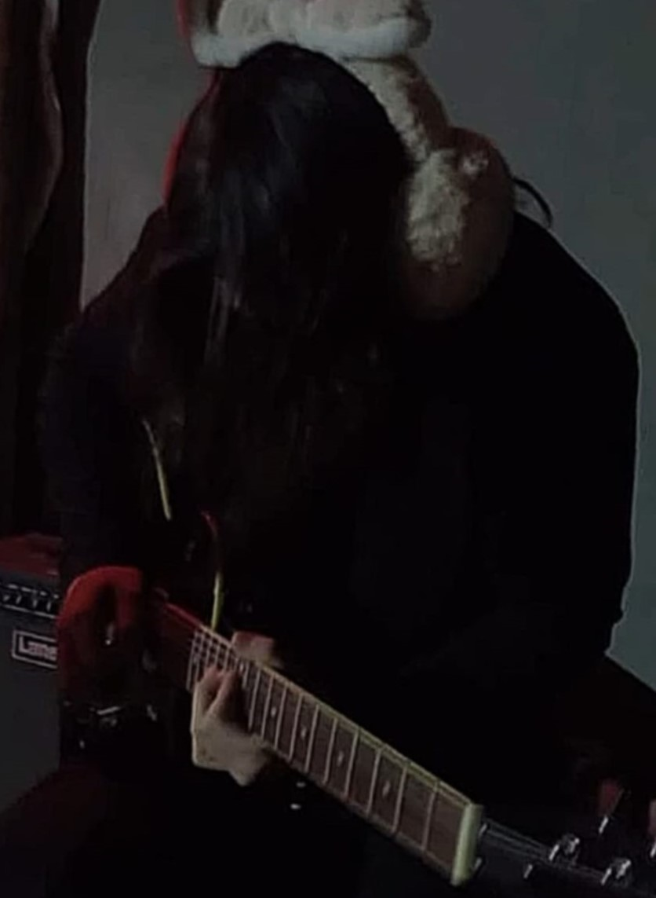

# Lucas Avalos

Me llamo Lucas y este es mi cuarto cuatrimestre en la carrera, es mi primera experiencia en una universidad ya que lo mas parecido que hice fue cursar dos años en un conservatorio cuando tenía 15.

Llegué a la unahur por un amigo de la secundaria que comenzó sus estudios un año antes que yo, al no saber que estudiar, decidí no pensarlo mucho y anotarme en la misma carrera que el. Al principio fue 
muy difícil ya que no sabía si realmente me gustaba la carrera o la estaba haciendo por inercia, esto fue así hasta que me topé con la materia Programación Estructurada, en la que me tocó cursar con 
excelentes profesores (emi y hernán) que me hicieron empezar a interesarme mucho más por la carrera, al punto de comenzar a hacer cursos y adquirir conocimientos por fuera de la universidad.

A día de hoy no me imagino estudiando ni dedicandome a otra cosa que no sea esto, y me gustaría en un futuro poder ser profesor, para tener la oportunidad de inspirar a mis alumnos tal y como mis 
profesores lo hicieron conmigo.

## Gustos e intereses:
* Toco la guitarra desde los 14 años (tengo 20), este mi es hobby no tan hobby principal, intento ser muy versatil pero lo que mejor toco es Blues y Metal.

* Me encanta todo tipo de música y tengo una fascinación muy grande por el audio.

* Amo todo lo que tenga que ver con el horror, películas, videojuegos, música, literatura, etc.

* Me gustan los gatos.

